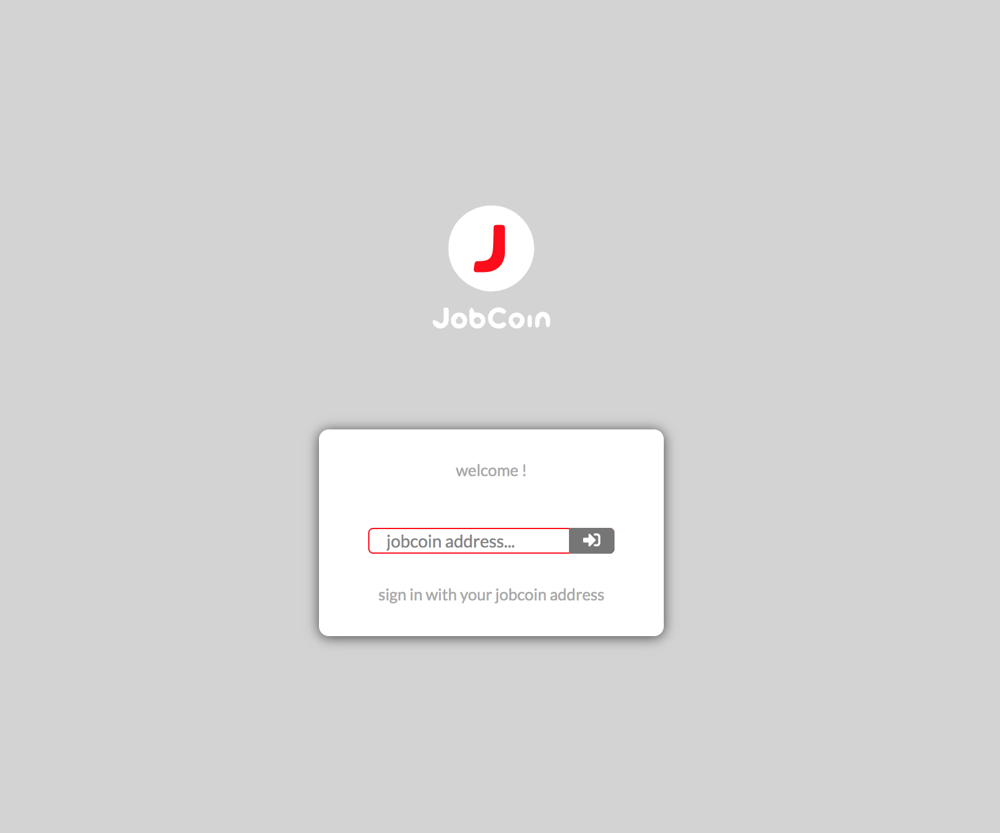
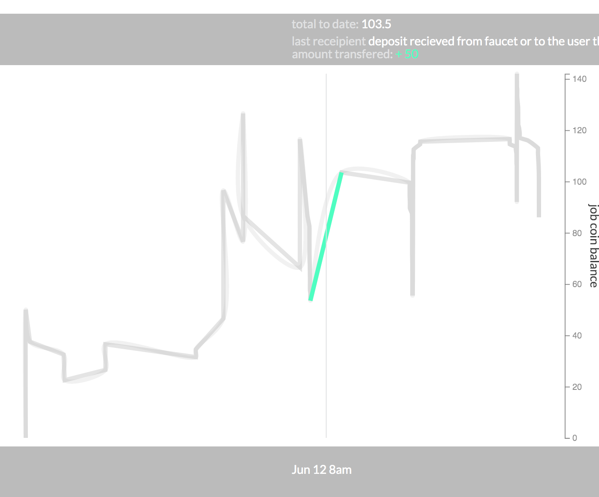
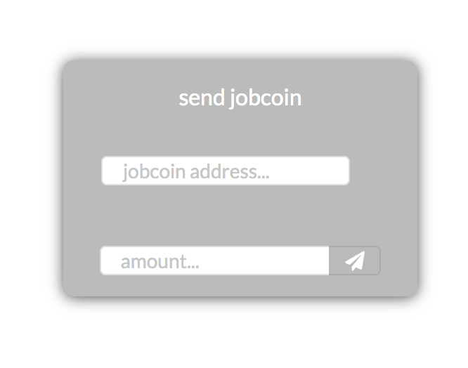

# JobCoin Interface

## description 
This is the summary economic analysis for a blockchain real estate company focus on tokenizing building equity. The main argument is that micro ownership of housing would allow us to increasing affordability, build middle calss wealth and help foster more sustainable compact urban development. 

## to run 

1) install dependencies 
```bash
npm install 
```
2) build dist file
```bash
npm run build
```
3) start-up script 
```bash
npm run dev
```
4) test run script 
```bash
npm run test (name of test)
```
and with watch
```bash
npm run test (name of test) -- --watch
```

## features
* Sign in widget that allows registered users to sign in, without a password. Users are created and given tokens using the Job Coin Management tool: 
[https://jobcoin.gemini.com/endurance](https://jobcoin.gemini.com/endurance) 
Test Users include 
* Alice
* Bob
* Jenny
* John
* Mat
* Justin
<br/>


* A sign out button that clears information related to previously logged in user from the store. 
<br/>


* Balance visualization of the entered jobcoin address that updates with each transaction and turns red
<br/>


* A Data visualization of the the user's balance over time and their transactions logged, which updates with each sent transaction. The graph is dynamically sized by the window screen on each load. The graph had large increases which makes it hard to pick up on individual dramatic transactions that took place on the same day. The transactions logged were difficult to interpolate using d3's curve feature as two point paths, but I used two lines to create a blurr effect. 
<br/>


* Transaction widget through transactions are pushed using the JobCoin API. Availabe Users are listed, and transactions are sent if the amount is below the balance and the user is valid. 
<br/>



## Tech/Framework used
React was the front-end framework used. The code was written in TypeScript, a strongly typed form of JavaScript. All components were styled in-line or using the Emotion library. D3 was used for scaling and data processing, while React retained control of DOM interactions. 

### use of hooks
In my attempt to show my familiarity with various coding techniques, the code is at times inconsistent. For example I use new functional programming techniques using hooks but I also build out component classes. Overall, I feel functional programming and hooks are a simpler and more understandable approach to most projects that arent managing a lot of state. For this reason much of the features were built using React's new Hook approach. 

The store used to pass around shared application data was built using hooks and context, which can also be passed to class components. 

### code scope and context
I am a big fan of organizing code around its use. If methods, objects or variables are only used in one place, they should be in that folder or file. If variables, objects or methods are used in a broader scope, they should be positioned accordingly. Thus helper functions, typescript types, and styles are often held in the file they are used, unless they are used more broadly. 

### testing
Since I am using typeScript, much of the code is type tested. 

While I see testing/TDD as critically important, I think my time was better spent optimizing the performance of the app's components given the time restraint. 

There are some residual typescipt errors due to compatability to react emotion props that were not resolved. 

###styling
React emotion lends itself to dyanmic rendering. It also lends itself to more modular code. The Emotion library enables dynamic rendering based on props and user interaction, as properties can be more readily passed to subcomponents. My favorite thing about the emotion library is that it allows a programmer to provide a descriptive tag for every element, so its use and functionality is more immediately apparent - making the code more readable. 

#### D3 limitation
There is one major limitation with the Reaction library is its use with d3. D3's approach expects you to style after attributing a class name. There are reasonable workarounds though.  

I have used d3 many times, and each time I feel like the methods used are confusing. While I still use d3 scales, I prefer to use svg and react. React gives you all the rendering power you would need for dynamic visualizations, and you can bring in d3 functionality as needed on top. 

## future improvements
The scaling feature appears to push new transaction paths upward beyond the scope of the SVG for some unknown reason when the user's currrent balance is near their higest balance. I didn't have time to figure what the issue was. It is likely something to do with the scaling of the graph being throw off when the number being scaled is beyond the scaling scope. 

